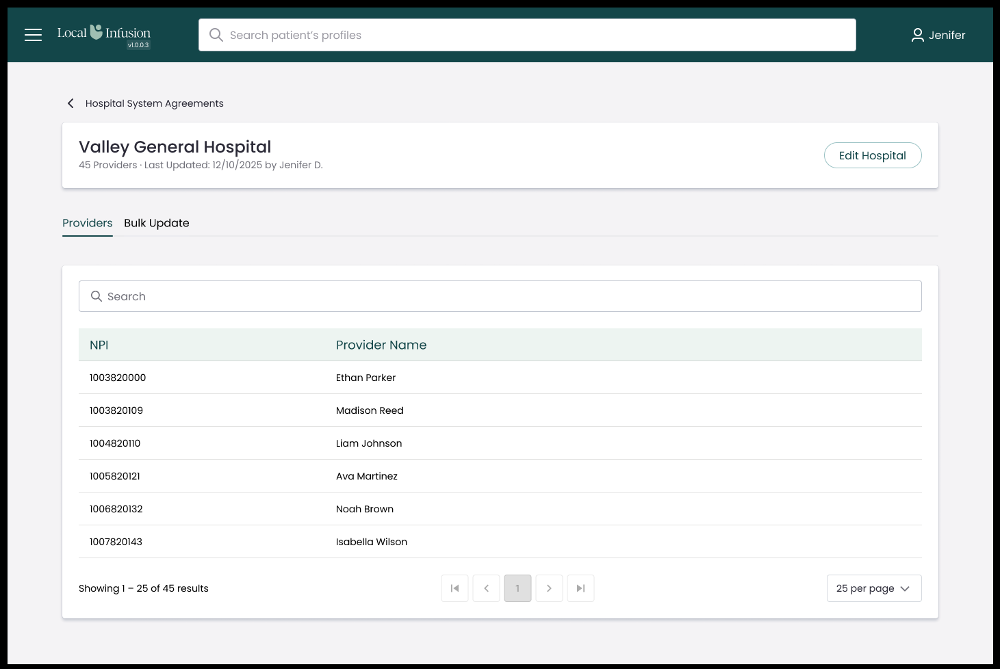

# MLID-1553 - Implement Providers Tab with NPI Table

## Context

This is the last task in Deliverable 2 (Hospital Detail View) of the MLID-1021 epic. The hospital detail page already exists (MLID-1551) with tab navigation (Providers / Bulk Update) and a placeholder for the Providers tab content. The API endpoint for provider NPI list retrieval also exists (MLID-1546). This task wires them together with a ProvidersTab component that displays a searchable, paginated NPI table.

Additionally, the design shows both NPI and Provider Name columns populated. The current schema only stores `providerNPIs: string[]` (flat NPI strings). This task includes a schema refactor: add a new `providers: { npi: string; name?: string }[]` field and switch all code to use it. The old `providerNPIs` field is left in the schema temporarily (not removed) — staging only has test data so no migration is needed. A cleanup to `$unset` the old field from documents and remove it from the schema should be done before any production release.

Names are optional — the D3 CSV upload may include 1 column (NPI only) or 2 columns (NPI + name).

**Branch:** `feature/MLID-1553-providers-tab-npi-table` (from `epic/MLID-1021-hospital-systems-340B`)

**Design reference:**



> **Migration note:** The old `providerNPIs` field remains in the schema but is no longer used by any code. Before production release, run `db.hospitalSystems.updateMany({}, { $unset: { providerNPIs: "" } })` and remove the field from the Mongoose schema.

---

## Design Analysis

The screenshot shows the Providers tab inside the hospital detail page:

- **Search bar**: Full-width input with magnifying glass icon, placeholder "Search" — spans the entire card width (no other toolbar elements)
- **Table**: Two columns — **NPI** (~1/3 width) and **Provider Name** (~2/3 width)
  - Header row: light teal background (#edf4f1), teal text (#134649)
  - Data rows: clean white rows separated by light border lines
  - Provider Name shows actual names when available, "---" when not
- **Pagination bar**: Three sections in a single row:
  - Left: "Showing 1 – 25 of 45 results"
  - Center: First / Prev / Page numbers / Next / Last buttons
  - Right: "25 per page" dropdown
- Everything rendered inside the existing `Card` component on the detail page

---

## Acceptance Criteria (from Jira)

- Table displays NPI column and Provider Name column (name may be empty)
- Search input filters by NPI or name in real-time (500ms debounce)
- Pagination: "Showing X - Y of Z results", adjustable per page (default: 25)
- Empty state when no providers exist
- Loading state while fetching

---

## Implementation Steps (TDD)

### Step 1: Schema Refactor — add `providers` field

Add a new `providers` field alongside the existing `providerNPIs` (which stays but is no longer used).

#### 1a. Model (`apps/web/models/HospitalSystem.ts`)

- Add `providers` field to `HospitalSystemDocument` interface: `providers: { npi: string; name?: string }[]`
- Keep `providerNPIs` in the interface (deprecated, not removed yet)
- Define a sub-schema `ProviderSchema` (`_id: false`):
  - `npi: { type: String, required: true, validate: /^\d{10}$/ }`
  - `name: { type: String, default: '' }`
- Add `providers: { type: [ProviderSchema], default: [] }` to the schema
- Update virtual `providerCount`: `this.providers?.length ?? 0` (no longer reads `providerNPIs`)

#### 1b. MongoDB Service (`apps/web/services/mongodb/hospitalSystem.ts`)

**Types:**
- `HospitalSystemListItem`: replace `providerNPIs: string[]` with `providers: { npi: string; name?: string }[]`
- `ProvidersListResponse.data`: change from `string[]` to `{ npi: string; name?: string }[]`

**Functions:**
- `getHospitalSystems()`: map `h.providers` instead of `h.providerNPIs` for both `providerCount` and `providers` fields
- `getProviders()`: read `hospital.providers` instead of `hospital.providerNPIs`; search filters on both `npi` and `name`
- `bulkUpdateProviders()`: accept `providers: { npi: string; name?: string }[]` instead of `npis: string[]`; validate `npi` field; deduplicate by `npi`; `$set: { providers: ... }`

#### 1c. Update Existing Tests

Update all mock data and assertions that reference `providerNPIs`:

- `apps/web/services/mongodb/__tests__/hospitalSystem.test.ts` — mock data + assertions for `getHospitalSystems`, `getHospitalSystemById`, `createHospitalSystem`, `getProviders`, `bulkUpdateProviders`
- `apps/web/app/api/hospitals/[id]/providers/route.test.ts` — mock response `data` from `string[]` to `{ npi, name }[]`
- `apps/web/app/hospital-system-agreements/[id]/page.test.tsx` — `mockHospital.providerNPIs` → `mockHospital.providers`

#### 1d. Update Detail Page Reference

**File:** `apps/web/app/hospital-system-agreements/[id]/page.tsx` line 157

`{hospital.providerNPIs?.length ?? hospital.providerCount ?? 0}` → `{hospital.providers?.length ?? hospital.providerCount ?? 0}`

#### 1e. Update Client Service Types

**File:** `apps/web/services/hospitalSystems/hospitalSystemService.ts`

`HospitalSystemDetail.providerNPIs: string[]` → `HospitalSystemDetail.providers: { npi: string; name?: string }[]`

---

### Step 2: Add `fetchProviders()` to Client Service

**File:** `apps/web/services/hospitalSystems/hospitalSystemService.ts`

```ts
export interface ProviderItem {
  npi: string;
  name?: string;
}

export interface FetchProvidersParams {
  page?: number;
  pageSize?: number;
  search?: string;
}

export interface ProvidersListResponse {
  data: ProviderItem[];
  pagination: { page: number; pageSize: number; totalCount: number; totalPages: number };
}

export const fetchProviders = async (
  hospitalId: string,
  params: FetchProvidersParams = {}
): Promise<ProvidersListResponse> => { ... };
```

**Test file:** `apps/web/services/hospitalSystems/hospitalSystemService.test.ts`
- Test URL construction with default and custom params
- Test successful response parsing (returns provider objects)
- Test error handling (non-ok response)

---

### Step 3: Create ProvidersTab Component

**New file:** `apps/web/app/hospital-system-agreements/[id]/components/ProvidersTab.tsx`

Props:
```ts
interface ProvidersTabProps {
  hospitalId: string;
}
```

Features:
- Calls `fetchProviders(hospitalId, { page, pageSize, search })` on mount and when filters change
- Search input with SearchIcon (same pattern as list page: native input, 500ms debounce via `useRef` timer)
- Table with two columns: **NPI** and **Provider Name** (shows `provider.name` if present, "---" otherwise)
- Pagination component (reuse existing `Pagination` from `components/UI/Pagination`) when >1 page; fallback with Select for page size when 1 page
- Loading state: `LoadingSpinner` component
- Empty state: centered message "No providers found."
- Error state: error message

**New file:** `apps/web/app/hospital-system-agreements/[id]/components/ProvidersTab.module.css`

Reuse styling patterns from the list page (`apps/web/app/hospital-system-agreements/styles.module.css`):
- Search wrapper with icon positioning
- Table with thead/tbody styling (same colors: #edf4f1 header bg, #134649 header text)
- Pagination fallback layout
- Empty/error states

**Test file:** `apps/web/app/hospital-system-agreements/[id]/components/ProvidersTab.test.tsx`
- Test table renders NPI column with data
- Test Provider Name column shows name when available
- Test Provider Name column shows "---" when name is empty
- Test search input filters providers (debounced)
- Test pagination displays correct "Showing X-Y of Z results"
- Test results per page dropdown works
- Test empty state renders when no providers
- Test loading state renders while fetching
- Test error state on API failure

---

### Step 4: Wire ProvidersTab into Detail Page

**File:** `apps/web/app/hospital-system-agreements/[id]/page.tsx`

- Import `ProvidersTab` component
- Replace the `<div className={styles.placeholder}>Providers content — see MLID-1553</div>` with `<ProvidersTab hospitalId={id!} />`

---

### Step 5: Update Detail Page Tests

**File:** `apps/web/app/hospital-system-agreements/[id]/page.test.tsx`

- Add mock for `fetchProviders`
- Update the existing tab tests to verify ProvidersTab renders when Providers tab is active
- Test that switching to Bulk Update tab hides ProvidersTab

---

### Step 6: Add URL Search Params to ProvidersTab Pagination

The hospital list page (`/hospital-system-agreements`) persists pagination/search state in URL search params so users can bookmark, share, or use browser back/forward. The ProvidersTab on the detail page currently uses only local React state — meaning page/search/pageSize resets when navigating away and back. This step adds the same URL param pattern.

Replicate the pattern from `apps/web/app/hospital-system-agreements/page.tsx` (lines 47-55, 62-73, 97-117):

**URL example:** `/hospital-system-agreements/abc123?page=2&pageSize=50&search=smith`

#### 6a. ProvidersTab.tsx changes

- Import `useSearchParams`, `useRouter`, `usePathname` from `next/navigation`
- Add `getFiltersFromUrl(searchParams)` helper returning `{ page, pageSize, search }` with defaults (1, 25, '')
- Initialize state from URL: `useState(() => getFiltersFromUrl(searchParams))`
- Add `updateUrl(newFilters)` that builds `URLSearchParams` and calls `router.push(pathname + '?' + params, { scroll: false })`
  - Always set `page` and `pageSize`
  - Only set `search` if non-empty
- Replace direct `setPage`/`setPageSize`/`setSearch` calls with a unified update function that sets state + pushes URL + triggers fetch
- Set the search input's `defaultValue` from URL params so it shows the persisted search term
- Keep the 500ms debounce on search input

#### 6b. ProvidersTab.test.tsx changes

- Mock `next/navigation` (`useRouter`, `useSearchParams`, `usePathname`)
- Test: initializes from URL params when present
- Test: pushes updated URL when page changes
- Test: pushes updated URL when search changes
- Test: omits search from URL when empty

---

## Files to Create/Modify

| Action | File | Step |
|--------|------|:----:|
| Modify | `apps/web/models/HospitalSystem.ts` | 1a |
| Modify | `apps/web/services/mongodb/hospitalSystem.ts` | 1b |
| Modify | `apps/web/services/mongodb/__tests__/hospitalSystem.test.ts` | 1c |
| Modify | `apps/web/app/api/hospitals/[id]/providers/route.test.ts` | 1c |
| Modify | `apps/web/app/hospital-system-agreements/[id]/page.tsx` | 1d, 4 |
| Modify | `apps/web/app/hospital-system-agreements/[id]/page.test.tsx` | 1c, 5 |
| Modify | `apps/web/services/hospitalSystems/hospitalSystemService.ts` | 1e, 2 |
| Modify | `apps/web/services/hospitalSystems/hospitalSystemService.test.ts` | 2 |
| Create | `apps/web/app/hospital-system-agreements/[id]/components/ProvidersTab.tsx` | 3 |
| Create | `apps/web/app/hospital-system-agreements/[id]/components/ProvidersTab.module.css` | 3 |
| Create | `apps/web/app/hospital-system-agreements/[id]/components/ProvidersTab.test.tsx` | 3, 6b |

## Reusable Components/Functions

- `Pagination` from `@/components/UI/Pagination/Pagination.tsx`
- `LoadingSpinner` from `@/components/UI`
- `Select` from `@/components/UI`
- `SearchIcon` from `@mui/icons-material/Search`
- Debounce pattern from list page (`useRef` + `setTimeout` 500ms)
- Table styling from `apps/web/app/hospital-system-agreements/styles.module.css`

## Verification

1. Run service layer tests: `cd apps/web && npx jest hospitalSystem.test.ts`
2. Run providers API tests: `cd apps/web && npx jest --testPathPattern="hospitals/\\[id\\]/providers"`
3. Run client service tests: `cd apps/web && npx jest hospitalSystemService.test.ts`
4. Run ProvidersTab tests: `cd apps/web && npx jest ProvidersTab.test.tsx`
5. Run detail page tests: `cd apps/web && npx jest --testPathPattern="hospital-system-agreements/\\[id\\]/page"`
6. Run all hospital tests together: `cd apps/web && npx jest --testPathPattern="hospital"`
7. Type check: `cd apps/web && npx tsc --noEmit`
8. Lint: `cd apps/web && npx eslint app/hospital-system-agreements/ services/mongodb/hospitalSystem.ts services/hospitalSystems/ models/HospitalSystem.ts`
9. Coverage check on modified files: ensure >80% coverage
