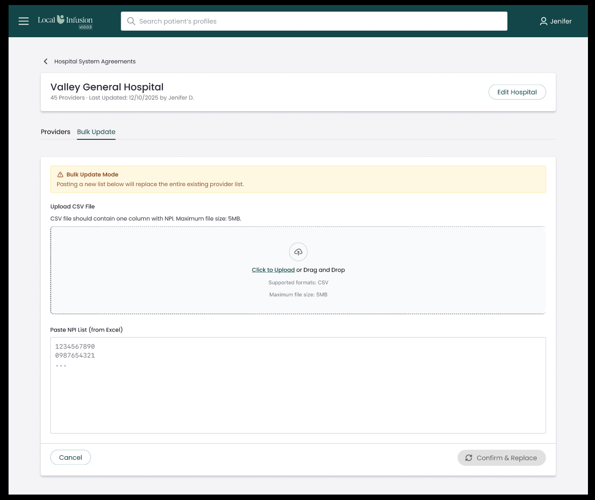

# MLID-1554 — Create Bulk Update Tab Layout

## Context

The Hospital Detail page (`apps/web/app/hospital-system-agreements/[id]/page.tsx`) already has two tabs — "Providers" and "Bulk Update". The Bulk Update tab currently renders a placeholder div. This task replaces the placeholder with the actual layout shell: a warning banner, two input sections (CSV upload + paste NPI), action buttons, and proper styling. The actual CSV parsing (MLID-1555), paste logic (MLID-1556), NPI validation (MLID-1557), and confirm flow (MLID-1558) will be wired in by later tasks — this is the container/skeleton only.

## Figma Reference



## Files to Create

### 1. `apps/web/app/hospital-system-agreements/[id]/components/BulkUpdateTab.tsx`

New component following the same pattern as `ProvidersTab.tsx`.

**Props:**
```typescript
interface BulkUpdateTabProps {
  hospitalId: string;
  onCancel: () => void;  // switches back to Providers tab
}
```

**Renders (per Figma):**

1. **Warning banner** — cream/yellow background (`#fef9c3`), no visible border. Contains `WarningAmberOutlined` MUI icon + "Bulk Update Mode" title + "Pasting a new list below will replace the entire existing provider list." message, all in amber text (`#b45309`).

2. **Upload CSV File section** — section title "Upload CSV File" (bold, outside the drop zone). Description text: "CSV file should contain one column with NPI. Maximum file size: 5MB." Below it, a **dashed-border drop zone** (rounded corners) with:
   - Cloud upload icon in a circular background
   - "**Click to Upload** or Drag and Drop" (Click to Upload is link-styled/underlined)
   - "Supported formats: CSV" (gray)
   - "Maximum file size: 5MB" (gray)
   - No actual upload logic — that's MLID-1555

3. **Paste NPI List (from Excel)** — section title includes "(from Excel)". **Textarea is enabled** (not disabled), with placeholder text: `"1234567890\n0987654321\n..."`. No paste processing logic yet — that's MLID-1556.

4. **Action buttons** — `justify-content: space-between`:
   - **Cancel** — left side, outlined/rounded style (matches `editButton` pattern from detail page styles), calls `onCancel`
   - **Confirm & Replace** — right side, has a `SyncOutlined` MUI icon, rendered as **disabled** (grayed out). No handler yet — that's MLID-1558.

### 2. `apps/web/app/hospital-system-agreements/[id]/components/BulkUpdateTab.module.css`

CSS module following the same color scheme and conventions as `ProvidersTab.module.css` and `styles.module.css`.

Key styles:
- `.warningBanner` — background `#fef9c3`, padding, border-radius, flex row with gap
- `.warningIcon` — amber color (`#b45309`)
- `.warningTitle` — font-weight 600, amber color
- `.warningMessage` — amber color, regular weight
- `.sectionTitle` — bold, margin-top spacing between sections
- `.sectionDescription` — gray description text below title
- `.uploadZone` — dashed border (`#d1d5db`), border-radius, centered content, min-height ~150px
- `.uploadIcon` — circular background, centered
- `.uploadText` — "Click to Upload" link-styled portion + "or Drag and Drop" regular text
- `.uploadHint` — gray small text for supported formats and size
- `.textarea` — full width, min-height ~180px, border, border-radius, font-family monospace, padding, placeholder color
- `.actions` — flex row, `justify-content: space-between`, margin-top
- `.cancelButton` — outlined, rounded (matching editButton pattern)
- `.confirmButton` — gray background when disabled, rounded, flex with icon

### 3. `apps/web/app/hospital-system-agreements/[id]/components/BulkUpdateTab.test.tsx`

Test file covering the Jira acceptance criteria:

| # | Test case |
|---|-----------|
| 1 | Warning banner renders with "Bulk Update Mode" title |
| 2 | Warning banner renders with correct replacement message |
| 3 | CSV upload section renders with "Upload CSV File" title |
| 4 | CSV upload section renders description "CSV file should contain one column with NPI. Maximum file size: 5MB." |
| 5 | Upload drop zone renders with "Click to Upload" and "Drag and Drop" text |
| 6 | Upload drop zone shows "Supported formats: CSV" |
| 7 | Paste section renders with "Paste NPI List (from Excel)" title |
| 8 | Paste textarea is rendered and enabled (not disabled) |
| 9 | Paste textarea has placeholder with example NPIs |
| 10 | "Cancel" button renders and calls `onCancel` when clicked |
| 11 | "Confirm & Replace" button renders and is disabled |

## Files to Modify

### 4. `apps/web/app/hospital-system-agreements/[id]/page.tsx`

- Import `BulkUpdateTab`
- Replace the placeholder `<div>` in the `bulk-update` tab condition with:
  ```tsx
  <BulkUpdateTab hospitalId={id!} onCancel={() => setActiveTab('providers')} />
  ```

### 5. `apps/web/app/hospital-system-agreements/[id]/page.test.tsx`

- Update existing test "should hide ProvidersTab when switching to Bulk Update tab" to also verify BulkUpdateTab content appears (warning banner text)
- Add test: switching to Bulk Update tab shows warning banner with "Bulk Update Mode"
- Add test: Cancel button in Bulk Update tab switches back to Providers tab

## Implementation Order (TDD)

1. **RED** — Write `BulkUpdateTab.test.tsx` with all 11 test cases (expect failures)
2. **GREEN** — Create `BulkUpdateTab.tsx` + `BulkUpdateTab.module.css` to pass tests
3. **REFACTOR** — Clean up styles, ensure visual consistency with Figma
4. **RED** — Add new tests to `page.test.tsx` for integration (expect failures)
5. **GREEN** — Update `page.tsx` to wire in `BulkUpdateTab`
6. **Verify** — Run all tests, check types, check lint

## Reusable Components & Utilities

- `Button` from `@/components/UI` — Cancel and Confirm & Replace buttons
- `WarningAmberOutlined` from `@mui/icons-material` — warning banner icon
- `CloudUploadOutlined` from `@mui/icons-material` — upload drop zone icon
- `SyncOutlined` from `@mui/icons-material` — Confirm & Replace button icon
- CSS color palette: primary teal `#134649`, text `#2b2a37`, gray `#71717a`, border `#e2e8f0`, warning bg `#fef9c3`, warning text `#b45309`

## Verification

```bash
# Run BulkUpdateTab tests
cd apps/web && npx jest --testPathPattern="BulkUpdateTab" --verbose --coverage

# Run detail page tests (integration)
cd apps/web && npx jest --testPathPattern="hospital-system-agreements.*\\[id\\].*page" --verbose

# Type check
cd apps/web && npx tsc --noEmit

# Lint
cd apps/web && npx eslint app/hospital-system-agreements/\[id\]/components/BulkUpdateTab.tsx
```
